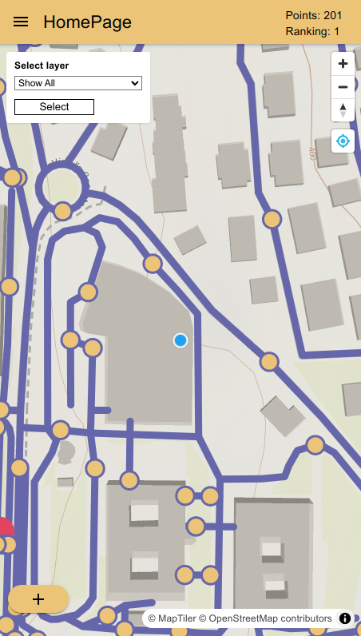
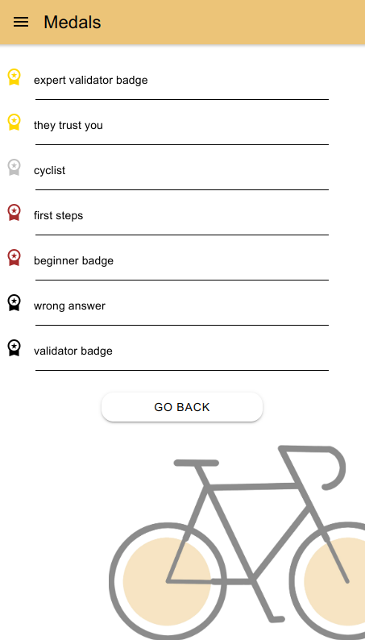

</img>
</img>
</img>
</img>
</img>
</img>
<!--

-->

English README version: [README.en.md](README.en.md)

- [Project Description](https://docs.google.com/document/d/1WZByJ2fpNfX1I89BCJPFwTi1muwKX84cQAa3ABBLkHc/edit?usp=sharing)
- [Video Setup Tutorial](https://drive.google.com/file/d/14lH2EOqcvlQlqfrdfaNT3S3AoQc3HDMO/view?usp=sharing)
- [Video Describing the project](https://drive.google.com/file/d/1y8Lin66vJZ9Ad7uO6CrAnXnDYc0SI0EZ/view?usp=sharing)
- [Presentation](https://drive.google.com/file/d/1GkWwk5YkMv0IePnH0if-U5k2y349Ykgc/view?usp=sharing)
- [Test the app on heroku](https://biking-improver.herokuapp.com)  Heroku non ha più un piano gratuito, per cui questo link potrebbe non funzionare più, se questo è il caso allora seguire il link successivo dove la app è hostata sul servizio render.
- [Test the app on Render.com](https://biking-improver.onrender.com)

# REQUIREMENTS 
L'applicazione è stata creata su ambiente Ubuntu 20.04. Su docker è presente la versione ubuntu con i pacchetti necessari installati alla repository franz99/ubuntu_image_web:ubuntu_ready_packages. Altrimenti potete installarli sul vostro ambiente ubuntu.
I pacchetti usati sono:
- git, "apt-get update \ && apt-get -y install git"
- unzip, "apt-get install unzip"
- nodejs, "apt-get install -y nodejs"
- npm, "apt-get -y install npm"
- @mapbox/geojson-merge, "npm install --save @mapbox/geojson-merge" "npm install -g @mapbox/geojson-merge"
- python2.7, "apt-get -y install python2.7"
- python3.8, "apt-get -y install python3.8"
- python3-pip, "apt-get -y install python3-pip"
- sqlite3, "apt-get install sqlite3"
- libsqlite3-mod-spatialite, "apt-get install -y libsqlite3-mod-spatialite"
- build-essential "apt-get -y install build-essential"
- make, "apt-get install make"
- libsqlite3-dev, "apt-get install libsqlite3-dev"
- zlib1g-dev, "apt-get install zlib1g-dev"
- vim, "apt-get -y install vim"
- tippecanoe, "git clone https://github.com/mapbox/tippecanoe.git" quindi andare nella cartella tippecanoe e lanciare i comandi "make -j" "make install"

# SETUP 
Muoversi all'interno dell cartella riguardante la [web-app](AllNeededDirectories/bicycle-osm-app) e creare un file chiamato .env, dopodichè seguire le indicazioni dei prossimi paragrafi.

***Gamification Engine*** 
Prima di iniziare con la creazione della web-app, bisogna verificare di poter accedere a tutti i servizi. 
Come prima cosa verificare di poter accedere e effettuare il login alla gamification engine online di FBK(Fondazione Bruno Kessler) al link: https://gamification-test.platform.smartcommunitylab.it/gamification/consoleweb/#/home. Se non si hanno i permessi per accedere allora si può provare a contattare il developer per richiedere i dati di accesso oppure bisognerà creare una istanza locale della gamification engine seguendo le indicazioni date sulla repository github https://github.com/smartcommunitylab/smartcampus.gamification. 
Nel caso in cui si sia creata un'istanza locale, bisognerà creare un nuovo gioco (tramite il bottone add new game), quindi bisognerà inserire le [regole](RulesInGamification) presenti in questa repository (RulesInGamification) all'interno dell'istanza del gioco della gamification engine nella sezione Rules. Bisognerà quindi creare le seguenti azioni nella sezione Actions del gioco all'interno della gamification engine:
- GetsValidatedFiveTimes
- GetValidatedOneTime
- GiveTrust
- RemovePoints
- TestData
- RemoveImage
- BuyPowerUp
- ChangeName
- PinAnswerCompletedTry
- BuyImage
- AddImage
- PointInserted
- ValidatePoint
- CreateImage
- PinAnswerCompleted
- ResetCustom

Creare quindi i seguenti concetti di gioco nella sezione "Concepts/Points" del gioco:
- GoldCoins
- AccumulatedPoints

Creare le seguenti badge nella sezione "Concepts/BadgeCollections":
- beginner badge
- expert contributor
- they trust you
- wrong answer
- expert badge
- contributor
- professional badge
- trusted contributor
- validator badge
- expert validator badge
- first steps
- professional cyclist
- cyclist
- green leaves
 
Se invece utilizzi l'istanza online della gamification engine, il gioco che viene utilizzato ha nome OpenStreetMap e i dati li potrai vedere all'interno di esso.
 
 

Che tu abbia utilizzato l'istanza online o l'istanza locale della gamification engine, questo passaggio è da seguire in ogni caso.
Fatto ciò la gamification engine sarà pronta ad essere utilizzata.
Andare all'interno della cartella riguardante la [web-app](AllNeededDirectories/bicycle-osm-app) e inserire all'interno del file .env precedentemente creato i parametri riguardanti la gamification engine, ossia:
- ID_GAME_USER = id utilizzato durante il login nella gamification engine
- ID_GAME_ENGINE = id del gioco che è stato creato nella gamification engine
- PW_GAME_ENGINE = password con la quale effettuare il login nella gamification engine
- GAMIFICATION_LINK = link all'istanza della gamification engine. (per es.: https://gamification-test.platform.smartcommunitylab.it o localhost:8010)

***Auth0*** 
L'appicazione utilizza auth0 per gestire l'autenticazione degli user. Per creare la web-app è quindi necessario creare un account auth0 o utilizzarne uno già esistente (https://auth0.com/). 
una volta effettuato l'accesso ad auth0, creare un'applicazione e configurarla per l'utilizzo su vuejs seguendo la guida quick start. Basterà creare un'applicazione per vue.js con un nome. Successivamente creare una api sotto la sezione api.
All'interno della cartella riguardante la [web-app](AllNeededDirectories/bicycle-osm-app) creare un file chiamato auth_config.json e inserire i seguenti dati all'interno del json:
- "domain": Il dominio utilizzato dalla applicazione creata (può essere trovato nei settings della app)
- "clientId": Il client ID utilizzato dalla applicazione creata (può essere trovato nei settings della app)
- "audience": identifier della api creata, lo si trova nella sezione delle api.
- "client_secret": Il client_secret della app (lo si trova nella sezione delle applicazione riguardante le api)
- "grant_type": "client_credentials",
- "client_id_api": id delle api della applicazione (lo si trova nella sezione delle applicazione riguardante le api)
- "app_url": url della proprio applicazione (come il dominio ma con l'aggiunta iniziale di https://)

Se l'applicazione viene utiizzata solamente in locale inserire i seguenti indirizzi negli indirizzi di callback all'interno della applicazione su auth0: 
http://localhost:8080/callback, http://localhost:8080/myTiles. Inserire http://localhost:8080 nei campi callback, logout, weborigins, allowed origins nelle impostazioni della applicazione su auth0. Altrimenti seguire le indicazioni di Auth0. 

Nella DashBoard dell'applicazione collegata a Auth0 bisognerà aggiungere una azione custom che dev'essere chiamata durante il login. Quest'azione chiamata storeFirstNickName creerà un campo signUpName nello usr in modo da associarlo allo user della gamification engine. Codice su auth0 dashboard action custom: 

- exports.onExecutePostLogin = async (event, api) => { if (event.user.user_metadata.signUpName!=null) { console.log(Skipping the expensive task because it already occurred for ${event.user.email}.); return; } // do and expensive task api.user.setUserMetadata("signUpName", event.user.nickname); }; 

Aggiungere quindi un'altra azione chiamata saveUserSignUpName con codice: 

- exports.onExecutePreUserRegistration = async (event, api) => { //console.log(event.user) api.user.setAppMetadata("signUpName",event.user.nickname) console.log(api.user); };

Dovrà essere aggiunta quindi una regola che permetta di ottenere la metadata signUpName ogni qualvolta si vogliono ottenere le info dello user. Questa regola ha codice: 

- function (user, context, callback) { const namespace = 'myUserID'; user.user_metadata = user.user_metadata || {}; user.user_metadata.signUpName = user.user_metadata.signUpName || null; context.idToken[${namespace}signUpName] = user.user_metadata.signUpName; callback(null, user, context); } 

All'interno della sezione Actions/flow sempre in auth0 andare su login e quindi inserire la regola e la azione storeFirstNickName creata.
Andare ora su Actions/flow/PreUserRegistration e aggiungere la azione  saveUserSignUpName.

***EmailJS*** 
La webApp contiene anche una sezione nel quale è possibile lasciare scrivere delle mail ai developer. Il servizio che viene utilizzato è EmailJs(https://www.emailjs.com/). Se si volesse continuare ad utilizzare cambiando la mail allora bisognerà iscriversi al servizio e successivamente modificare i campi: 
- VUE_APP_EMAIL_JS_SERVICE_ID
- VUE_APP_EMAIL_JS_TEMPLATE_ID
- VUE_APP_EMAIL_JS_PUBLIC_KEY
- VUE_APP_EMAIL_JS_USER_ID

all'interno del file .env con i propri seguendo le indicazioni di EmailJs

# CREAZIONE TRAMITE DOCKER:  
Per creare la applicazione automaticamente tramite docker è necessario poter effettuare il login alla versione online della gamification engine di FBK. Altrimenti bisognerà aggiungere una sezione nel docker per gestire una versione locale della gamification. 
Per creare la app automaticamente basterà utilizzare i comandi docker presenti nella cartella [dockerComposeLogic](DockerLogicFolder/dockerComposeLogic). Bisognerà muovere la cartella AllNeededDirectories presente nel folder src all'interno della cartella dockerComposeLogic e quindi seguire le indicazioni presenti nel ReadMe all'interno di dockerComposeLogic. Se si segue questo metodo allora è necessario utilizzare docker.
 
 
# CREAZIONE SENZA DOCKER: 
Altrimenti il funzionamento generale è qui descritto:
- Nella cartella [AllNeededDirectories](AllNeededDirectories) vi è tutto il materiale riguardante il codice. 
- Per creare le geometrie, il database e tutte le informazioni che devono poi essere utilizzate all'interno della web-app gamificata bisogna aprire la cartella [create_geometry_spatialite](AllNeededDirectories/create_geometry_remake/create_geometry_spatialite). 
- Se si vogliono inserire le informazioni riguardanti le ciclabili di diverse città basterà inserire i file xml di quelle stesse città all'interno della cartella [CityDirectory](AllNeededDirectories/create_geometry_remake/create_geometry_spatialite/CityDirectory/) all'interno di create_geometry_spatialite. I file xml devono avere la struttura e forma dei file presenti in OSM. Si possono inserire un x numero di città. Dare al file xml  lo stesso nome della città presa in considerazione. Se si vogliono utilizzare invece dati di una pubblica amministrazione allora si può fare riferimento al codice presente in [TraduzioneTags](AllNeededDirectories/FerraraTranslation/TraduzioneTags) e usare la logica lì presente.
- Le missioni vengono create tramite il file tagAndKeys_NewVersion_Answer.yaml. Modificando questo file è possibile modificare tutte le missioni. Il funzionamento del file è descritto all'interno del codice "FBKIterateQuestions.ipynb" presente nella cartella [create_geometry_spatialite](AllNeededDirectories/create_geometry_remake/create_geometry_spatialite)
- Lanciare quindi il codice python del file "FBKIterateQuestions.ipynb" il quale creerà il database contenente le informazioni delle vie riguardanti le missioni e le domande a cui lo user dovrà rispondere. Il database creato si troverà nella cartella [database_prova](AllNeededDirectories/create_geometry_remake/create_geometry_spatialite/database_prova) con nome: withvalidation.db. Questo database va poi spostato all'interno della cartella [CreateOtherTables](AllNeededDirectories/CreateOtherTables) e rinominato applicationValid.db
- Una volta fatto ciò bisogna copiare/muovere le cartelle generate presenti in ["singleWaysFiles"](AllNeededDirectories/create_geometry_remake/create_geometry_spatialite/tmp/GeojsonFiles/singleWaysFiles) all'interno della cartella  AllNeededDirectories/tippecanoe/tippecanoe_funzionante/NewSystem/SingleWaysFiles/, copiare/muovere le cartelle presenti in ["singleNodesFiles"](AllNeededDirectories/create_geometry_remake/create_geometry_spatialite/tmp/GeojsonFiles/singleNodesFiles) all'interno della cartella AllNeededDirectories/tippecanoe/tippecanoe_funzionante/NewSystem/SingleNodesFiles/ e copiare/muovere le cartelle presenti in [GeojsonFiles/centerWayPoints](AllNeededDirectories/create_geometry_remake/create_geometry_spatialite/tmp/GeojsonFiles/centerWayPoints) all'interno della cartella src/AllNeededDirectories/tippecanoe/tippecanoe_funzionante/NewSystem/CenterGeojsonCittà
- Muoversi all'interno della cartella [CreateOtherTables](AllNeededDirectories/CreateOtherTables) e lanciare lo script otherTables.ipynb. Questo script creerà la lista di medaglie, la lista di power up e la lista di pin che l'utente potrà visualizzare e/o comprare. La logica di come vengono creati i powerup e i pin è descritta all'interno del README della cartella stessa. 
- Fatto ciò il database va spostato nella cartella [AllNeededDirectories/bicycle-osm-app/databases](AllNeededDirectories/bicycle-osm-app/databases)
- Tornare quindi nella cartella "src" di partenza entrare in tippecanoe, quindi tippecanoe_funzionante, quindi NewSystem.
- Aprendo il codice "newSystemPbfCreation.ipynb" e facendolo partire sarà possibile creare le cartelle contenenti i file pbf da dare in pasto successivamente a maplibre
- Lanciato il codice verranno generati dei file. Questi vanno spostati all'interno dell'applicazione. spostare le cartelle allNodesPbf, allWaysPbf e il file allNodesGeojson.geojson all'interno di AllNeededDirectories/bicycle_osm_app/pbfFiles. Spostare i file presenti in CenterGeojsonCittà all'interno di AllNeededDirectories/bicycle_osm_app/pbfFiles/CenterGeojson. Spostare i file wayLayers.txt e nodeLayers.txt all'interno di AllNeededDirectories/bicycle_osm_app/pbfFiles/LayersNames
- A questo punto è possibile lanciare l'applicazione. spostarsi nella cartella AllNeededDirectories/bicycle_osm_app e quindi lanciare i comandi "npm run build", "npm start" e dirigersi alla pagina "localhost:8080"
 

# CREAZIONE CON DATI DI COMUNE: 
- Se i dati provengono da un comune e sono differenti rispetto a quelli di OSM si possono utilizzare i codici presenti nella cartella "FerraraTranslation/TraduzioneTags"
- Il file "convertiTags.ipynb" permette di creare le tabelle csv con tutti i dati del comune e le traduzioni di quei dati su OSM. Ovviamente prima di poterlo usare bisogna modificare i file excel che indicano le traduzioni associate ai vari tag appartenenti al comune. Il funzionamento e lo standard di come scrivere sul file excel è spiegato all'interno del file "convertiTags.ipynb".
- Dopo aver creato le varie associazioni usando "convertiTags.ipynb"; è possibile creare le domande riguardanti la pubblica amministrazione presa in considerazione utilizzando il file "new_createMissions.ipynb"
- Anche in questo caso è presente un file yaml che può essere modificato per creare missioni diverse. In questo caso il file funziona in maniera più semplice. Siccome le traduzioni dei comuni sono 1 a 1 (per es.: su marciapiede = si contiene solo una chiave da verificare) il file yaml è più semplice e snello. Infatti per cambiare le domande basterà cambiare il campo "key" che rappresenta la chiave utilizzata dal comune (che verrà poi tradotta in OSM) e il campo question. 
- Se viene lanciato il codice si può così aggiungere a un database esistente le domande appartenenti al comune (si può anche creare un database nuovo volendo). 
- Fare attenzione agli id e possibili geometrie identiche. Se per es. il comune utilizza le stesse vie già presenti nel database ma queste hanno id e geometrie diverse ciò potrebbe creare problemi (bisogna quindi creare un metodo per unire le geometrie simili e avere una sola istanza con tutte le  domande nel db. Fare magari associazione dell'id di comune e OSM).
 

è possibile utilizzare sia dati di OSM che del comune. Basterà lanciare entrambi i codici (sia quello presente nella cartella create_geometry_spatialite che quello presente in FerraraTranslation), prima quello riguardante i dati di OSM e successivamente quello riguardante i dati del comune. Dopo aver lanciato i codici bisognerà muovere le cartelle all'interno di tippecanoe, creare i pbf e spostare quindi tutto nella cartella della web-app.
 
Se invece si vuole fare tutto automaticamente è possibile utilizzare le linee guida presenti in (DockerLogicFolder/dockerComposeLogic).
Se però si vuole automatizzare tutto con più dati di più comuni sarà da modificare la logica del docker, perchè per ora può creare quante città si vogliono utilizzando i dati di OSM ma solo una utilizzando i dati di un comune.  
Per ovviare alla cosa basterà aggiungere i dati di un secondo comune all'interno della cartella di tippecanoe. 

# FUNZIONAMENTO:  
L'applicazione è costituita da:
- Frontend creato tramite vue.js (framework di javascript) e MapLibre
- Backend costituito da un database spatialite contenente le informazioni riguardanti le vie e i punti di interesse (che volendo può essere sostituito da un database sql qualunque,però facendo ciò ci sarebbero da modificare alcune chiamate rest), il database spatialite contiene anche una tabella per ogni user contenente i potenziamenti che hanno acquistato in negozio; Gamification Engine di FBK, database Auth0 per tenere traccia dei login degli user e chiamate rest varie. 

Le domande vengono generate tramite i file presenti nella cartella [create_geometry_spatialite](AllNeededDirectories/create_geometry_remake/create_geometry_spatialite). Qui le missioni vengono generate consultando un file .yaml e ciclando su di esso. Successivamente le vie comprendenti della loro geometria vengono salvate sottoforma di geojson e xml, in modo da essere poi utilizzate per creare i pbf tramite tippecanoe. I pbf serviranno poi a MapLibre per mostrare le vie. 
Una volta generate le domande; tramite [tippecanoe](AllNeededDirectories/tippecanoe/tippecanoe_funzionante/NewSystem) vengono generati i pbf e uniti alcuni file in un unico solo per comodità. I pbf vengono poi letti da MapLibre per mostrare i dati al giocatore. Vengono utilizzati i pbf in quanto peseranno meno lato utente durante il caricamento. (pesano di più però lato server) 
La [web-app](AllNeededDirectories/bicycle-osm-app) per ora contiene solo 2 lingue, inglese e italiano. Se si vogliono aggiungere lingue basterà modificare il file [translation.js](AllNeededDirectories/bicycle-osm-app/src/utils) rispettando i parametri usati. 

# IMPORT LOGIC:  
L'import dei dati verso OSM viene effettuato tramite socket. In particolare la web-app fa una richiesta ogni 40 minuti per vedere se le domande hanno ricevuto una risposta e se queste hanno ricevuto 2 validazioni. Per ogni risposta con 2 validazioni viene ricercato lo user che ha dato la risposta, se questo viene trovato e ha fatto il login tramite OSM allora il dato viene importato dallo user verso OSM. Se lo user invece non ha effettuato il login tramite OSM il dato viene importato tramite un nostro account custom. Se invece lo user non viene trovato allora il dato non viene inviato. Il procedimento viene effettuato ogni 40 minuti e, se lo user non viene trovato dopo 5 volte, allora il dato viene inviato direttamente da un nostro account custom. 
Prima di effettuare l'import viene fatta una richeista get dell'elemento di cui si vuole fare l'update. Se questa richiesta non va a buon fine allora l'elemente non verrà aggiornato e verrà quindi scartato.
Durante l'import viene aperto un changeset con sorgente Biking-Improver. Una volta inviato il dato i cambiamenti che sono stati effettuati vengono salvati anche nel database nel caso in cui sia necessario effettuare un reverse. 
è necessario quindi avere un account dotato di pw e id per effettuare gli importche non vengono eseguiti dagli user.

